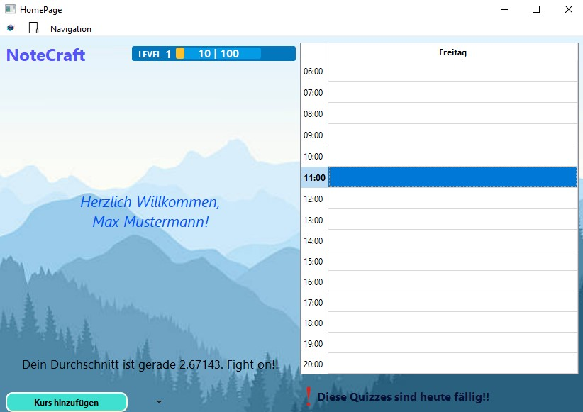
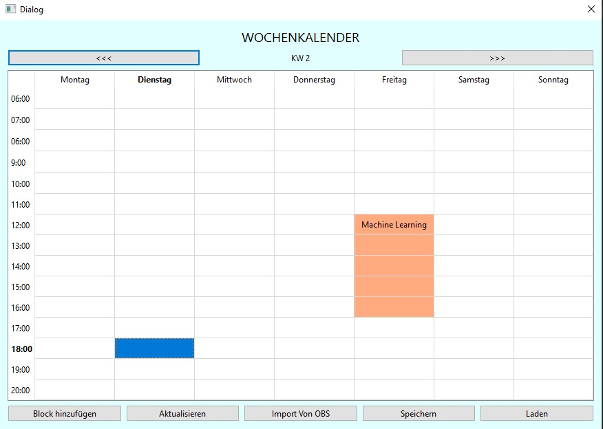
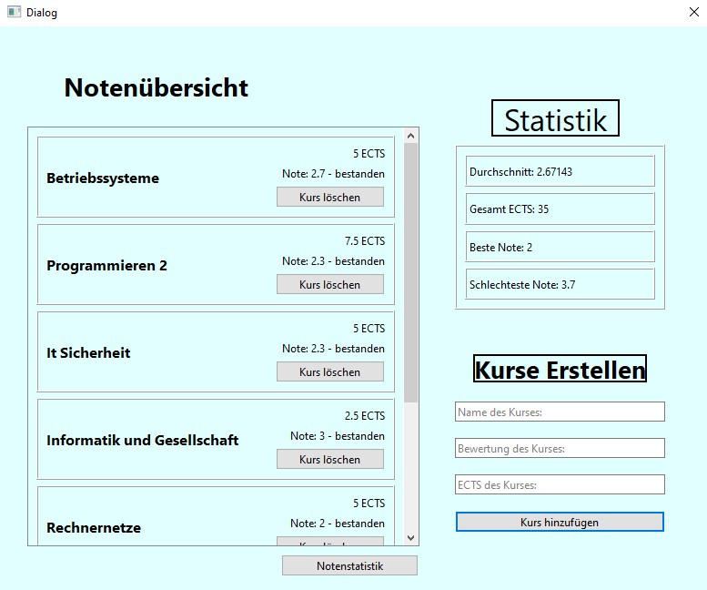
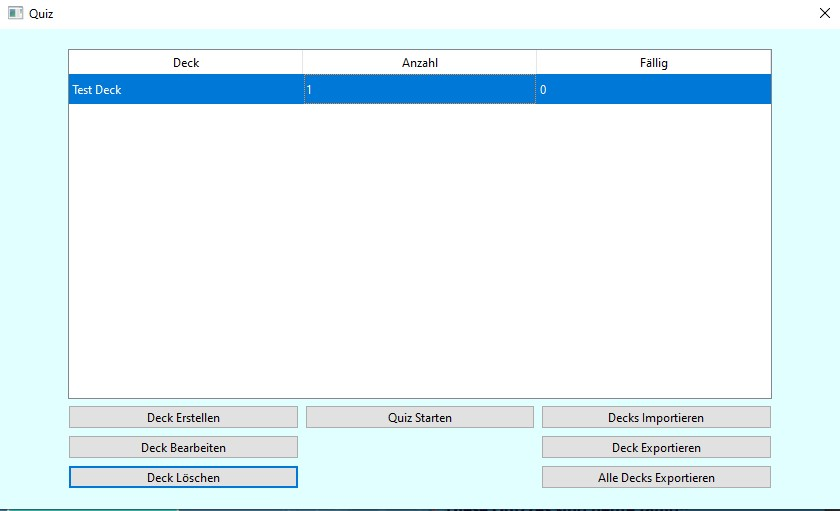

# NoteCraft

Software Engineering course project (Wintersemester 23, Hochschule Darmstadt) developed with a 4-member team to learn agile development and project management techniques. The code is unoptimized and outdated, reflecting my past practices and knowledge (I was a beginner at the time). Not suitable for production (no development build). My primary responsibility was the Calendar, though I contributed to various parts to ensure functionality.

## Table of Contents
- [Features](#features)
  - [Note Management](#1-note-management)
  - [Quiz System](#2-quiz-system)
  - [Calendar](#3-calendar)
  - [Grade Management](#4-grade-management)
  - [Level System](#5-level-system)
- [Technical Details](#technical-details)
  - [Architecture](#architecture)
  - [Key Components](#key-components)
  - [Data Storage](#data-storage)
- [Building the Project](#building-the-project)
  - [Prerequisites](#prerequisites)
  - [Build Steps](#build-steps)

NoteCraft is a comprehensive study management application built with Qt/C that helps students organize their academic life. It combines note-taking, quiz management, calendar scheduling, and grade tracking functionalities in one cohesive platform. The primary language used was German.

 ## Screenshots
 
 ### Home Page
 
 *Main dashboard showing recent notes, calendar, and level progress*

 ### Calendar View
 
 *Weekly calendar with color-coded course blocks*
 
 ### Grade Management
 
 *Grade tracking with statistics and ECTS overview*
 
 ### Quiz Interface
 
 *Flashcard interface with multiple card types*

## Features

### 1. Note Management
- Create and organize course-specific notes
- Rich text editing with image support
- Recent notes tracking
- Hierarchical organization by courses

### 2. Quiz System
- Multiple quiz card types:
  - Basic reversed cards
  - Multiple choice questions
  - Type-answer cards
- Spaced repetition learning
- Progress tracking

### 3. Calendar
- Weekly schedule view
- Course block management
- OBS calendar import support
- Color-coded events

### 4. Grade Management
- Course grade tracking
- ECTS credit monitoring
- Grade statistics and visualization
- GPA calculation

### 5. Level System
- Experience points (XP) for completed activities
- Level progression
- Visual progress tracking

## Technical Details

### Architecture
- Built with Qt 6 and C17
- Model-View-Controller (MVC) design pattern
- Singleton pattern for system-wide components
- File-based data persistence

### Key Components
- `HomePage`: Main application window and navigation hub
- `Notizen`: Note management system
- `Kalender`: Calendar and schedule management
- `Quiz`: Flashcard and quiz system
- `Notenliste`: Grade tracking and statistics

### Data Storage
- Notes stored in CSV format
- Calendar data in custom .notecraft format
- Quiz cards in structured text format

## Building the Project

### Prerequisites
- Qt 6.0 or higher
- C17 compatible compiler
- Qt Creator (recommended)

### Build Steps 
1. Open NoteCraft.pro in Qt Creator
2. Configure project for your kit
3. Build and run